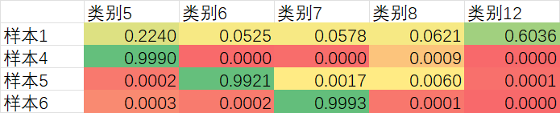

# 装甲板处理相关说明

## 相机输入
曝光时长: 2000ns ~ 8000ns

## 装甲板识别模块
[![](https://mermaid.ink/svg/pako:eNptVFtPE0EU_iubfaGNlFvECzEmGh980BfwbZc0090pXUN36-w2iARS5GKN0IqANCmFtFKIIF2iNZTW0sTf0tnd_gvPdKTUysvumXO-78x3zsyZOVExVCyOieFpY0aJIGIJz8Zl3YyHpgiKRYRWYZkeLLsfV2Vd1QhWLM3QhRePAUEUybvcpCtFmr2kS2lZ1icDgYfAmpXcxTNaPQQ_84SCUWRJrUySJn4BaHh0KBDSdERmWVAxdMuIE1Py6iVa22QuAitnN0HP0nRthWbL7v5XWi9MyjrW1S5hNJlzT7O9qoAcDBskiJES8UnUvmhWU46dblYSzcoxIZN-2GBCe4PHEVAkWWzlCu6R7dhbPnerBotBrsNP16qtnbIsMkGPzBjs0GFsN2ipzhhgDbr7p_9gpwxDDWq6il8DlJ5mmpWqu2g7ubzvOuIHaG81rZV1ENtbTZtzQzkjUAxP2y6oDTNJdzm3QBz7canQ9j4UMn0-bfClPzDs75NFmZ2g8EAYFvqFGTIYYfbQwGinBsTS8T28o0_sNM9LwIFTAQnDo-DoKhiRaHAm0iGwFlUPvVLeLe14X1bcre9OrtE6yTCSrP_F7JS981wPBtT-n5gJuc5y1X1IBHJvL4wM3L3TRYhqphlE19Ibe2610ayk-NJJFb3GBt1762bLkODe6O-zhfvw6UoQ00jn5GixDi3nJxdDGvF342AdNA1iMbR90cexfU4KesVmgcWd3feebUPjaHKV9w4Mmra9pbqTOKIHRzdcBM9epcmT3ovAsvn4TlcX-pj5IAG7AG0xlsHaBYP0zVkvgPpOz-DaX2FQOKzpGBI1aw16tkzTGcDyqtpx_OqpZloStMf5fMHmOvfOy-c7YUsC0U656PzY5vPcicQIVjUFmMU9t5Z26xtubReeDufnh2syIlPYkniBbm3T2du9ql7WO88MoPlkg8GHAgzOEfvFKCZRpKnwXM3JuiDIohXBUSyLY2CqOIzi0xZcbX0eoChuGROzuiKOWSSO-8V4TEUWfqIh6HNUHAujaRO8oNoyyHP-BLZfwvk_UwCFJw?type=png)](https://mermaid-js.github.io/mermaid-live-editor/edit#pako:eNptVFtPE0EU_iubfaGNlFvECzEmGh980BfwbZc0090pXUN36-w2iARS5GKN0IqANCmFtFKIIF2iNZTW0sTf0tnd_gvPdKTUysvumXO-78x3zsyZOVExVCyOieFpY0aJIGIJz8Zl3YyHpgiKRYRWYZkeLLsfV2Vd1QhWLM3QhRePAUEUybvcpCtFmr2kS2lZ1icDgYfAmpXcxTNaPQQ_84SCUWRJrUySJn4BaHh0KBDSdERmWVAxdMuIE1Py6iVa22QuAitnN0HP0nRthWbL7v5XWi9MyjrW1S5hNJlzT7O9qoAcDBskiJES8UnUvmhWU46dblYSzcoxIZN-2GBCe4PHEVAkWWzlCu6R7dhbPnerBotBrsNP16qtnbIsMkGPzBjs0GFsN2ipzhhgDbr7p_9gpwxDDWq6il8DlJ5mmpWqu2g7ubzvOuIHaG81rZV1ENtbTZtzQzkjUAxP2y6oDTNJdzm3QBz7canQ9j4UMn0-bfClPzDs75NFmZ2g8EAYFvqFGTIYYfbQwGinBsTS8T28o0_sNM9LwIFTAQnDo-DoKhiRaHAm0iGwFlUPvVLeLe14X1bcre9OrtE6yTCSrP_F7JS981wPBtT-n5gJuc5y1X1IBHJvL4wM3L3TRYhqphlE19Ibe2610ayk-NJJFb3GBt1762bLkODe6O-zhfvw6UoQ00jn5GixDi3nJxdDGvF342AdNA1iMbR90cexfU4KesVmgcWd3feebUPjaHKV9w4Mmra9pbqTOKIHRzdcBM9epcmT3ovAsvn4TlcX-pj5IAG7AG0xlsHaBYP0zVkvgPpOz-DaX2FQOKzpGBI1aw16tkzTGcDyqtpx_OqpZloStMf5fMHmOvfOy-c7YUsC0U656PzY5vPcicQIVjUFmMU9t5Z26xtubReeDufnh2syIlPYkniBbm3T2du9ql7WO88MoPlkg8GHAgzOEfvFKCZRpKnwXM3JuiDIohXBUSyLY2CqOIzi0xZcbX0eoChuGROzuiKOWSSO-8V4TEUWfqIh6HNUHAujaRO8oNoyyHP-BLZfwvk_UwCFJw)

## 预测模型
对于大装甲板和小装甲板分别训练了两个简单的图像分类模型

小装甲板: 64 * 64 * 1  
大装甲板: 64 * 128 * 1

一些测试结果:  
类别编号详见装甲板贴纸素材包  
样本0为小装甲板数字3; 样本4,5,6为大装甲板数字1,3,4; 其余样本为噪声 

